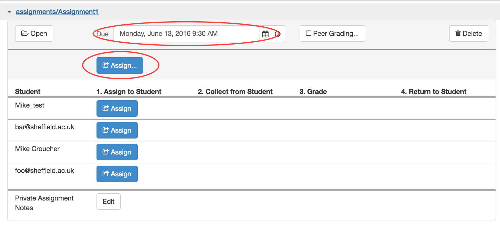
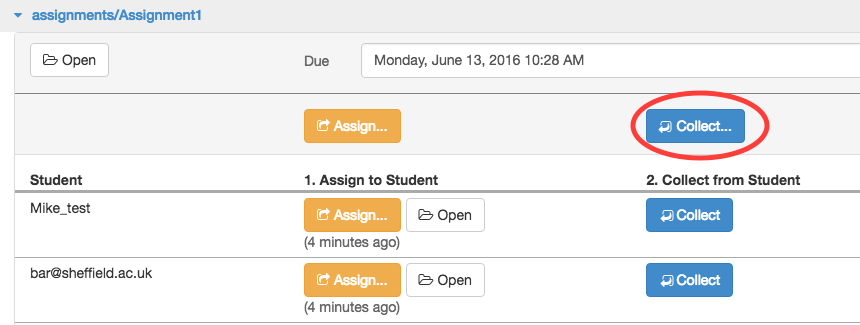
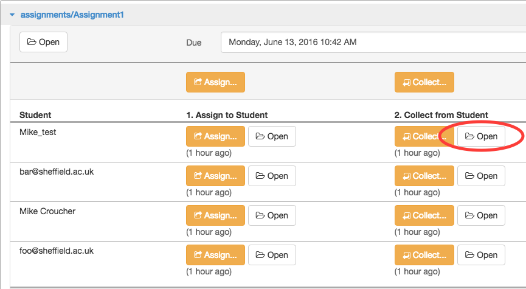
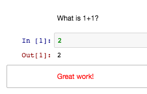
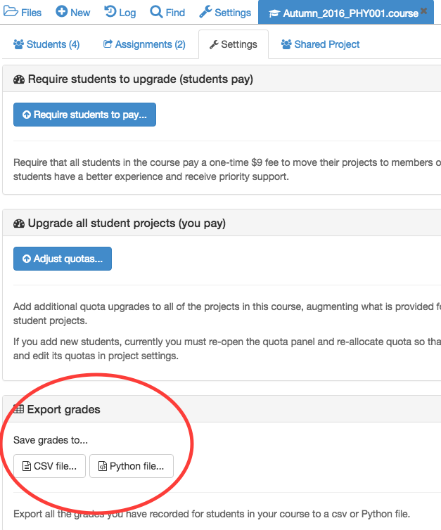

# Course management

No matter what you've added in the instructors view of the course, the students will not see any files until you explicitly assign them.

## Creating a new assignment

An assignment consists of a folder that contains one or more files to be distributed to your students.

Start off by creating a folder called **assignments** in the root directory of your course project.
Within this folder create a subfolder called, say, **Assignment1** and populate it with a Jupyter Notebook that contains the question(s) that you want your students to answer.

Open the **.course** file and click on the **Assignments** tab


Enter **assignment1** in the search box on the right hand of the screen.


The system will look for any folders with **assignment1** in their path name and  return a set of options. 
Highlight the one you want and click on **Add Selected Assignment**.


The new assignment will be added to the top of the list of assignments available for this course.


## Assigning an assignment to students

Click on the assignment in the assignment list.
When the assignment opens, set the **Due** date and click on the **Assign** button to assign to all students in the course.

Alternatively, you can assign just to individual students.



When an assignment is made to a student, a **copy** of the assignment folder will appear in their course project.

Advise the students that all work on the assignment should take place in this folder. Any work performed outside of this folder will not be collected.

## Peer Grading

A very useful function for formative assessment is **peer grading**.
Use peer grading to randomly (and anonymously -- but not now due to [a bug](https://github.com/sagemathinc/smc/issues/626)) redistribute collected homework to your students, so that they can grade it for you.

Within the assignment, click on the **Peer Grading** icon and follow the instructions to activate this feature.


## Collecting assignments from students

After an assignment has been made, a **Collect** icon appears next to each student.
Clicking on one of these will make a copy of the student's assignment folder to your account.
The entire folder will be copied including any extra files the student may have created.

Alternatively, click on the **Collect** icon in the top row to collect from all students simultaneously.



You should make sure that your project has enough disk space to accommodate this.
It may be necessary to purchase an upgrade if you need more than the free allowance (currently 3GB per project).

Once the assignment has been collected, anything the student subsequently does in **their** copy will not be reflected in **your** copy.

If you click on the **Files** icon and go to the root directory of the course project, you'll see that a new folder will have been created with the name **[your_course_name]-collect**


Navigating within this folder, you'll find that it has a similar file structure to the original assignment.
For example, for this demonstration we had the structure `/assignments/Assignment1` which appears in the collected folder as `[your_course_name]-collect/assignments/Assignment1`.
Entering this folder will give a view of all student's versions of this assignment


The folder corresponding to each collected assignment will have been given a unique random name.
Navigating inside this folder, you will see all collected files along with a text file whose filename identifies the student.


At this point, you can open and mark the student's returned assignment.

An easier interface for opening a student's collected assignment is via the **.course** file.
Simply click on the **Open** icon corresponding to the student you are interested in and you'll be taken to the folder described above.



## Grading

You are free to annotate the student's assignment in any way you like.
The student will get a copy of everything you do once you return it to them.

When working with Jupyter notebooks, I usually do my annotations in Markdown cells and surround my comments in HTML tags that colour the text red.
This allows the students to quickly identify my comments.

```
<font color="red">Great work!</font>
```



Once you've finished marking and commenting on the student's notebook, you can enter a grade via the **.project** file.
Click on the **Enter Grade** button to open up the grade entry text box and enter the grade.
This can be a number or any other string that makes sense for your course.


## Exporting grades

It is possible to export grades for all assignments as either a .csv file or as executable Python code.
The **Export grades** function is available in the **Settings** tab of the **.course** file.



The .csv file format looks like this:

```
# Course 'Autumn_2016_PHY001'
# exported 2016-06-13T13:24:40.141Z
Name,Email,"assignments/Assignment1","Notes"
"Mike Croucher","some.email@sheffield.ac.uk","80",""
"Mike_test ","some_other_email@sheffield.ac.uk","100",""
"bar@sheffield.ac.uk","bar@sheffield.ac.uk","90",""
"foo@sheffield.ac.uk","foo@sheffield.ac.uk","70",""
```

The corresponding Python code looks like this

```
course = 'Autumn_2016_PHY001'
exported = '2016-06-13T13:26:19.407Z'
assignments = ['assignments/Assignment1','Notes']
students = [
    {'name':'Mike Croucher', 'email':'some.email@sheffield.ac.uk', 'grades':['80','']},
    {'name':'Mike_test ', 'email':'some_other_email@sheffield.ac.uk', 'grades':['100','']},
    {'name':'bar@sheffield.ac.uk', 'email':'bar@sheffield.ac.uk', 'grades':['90','']},
    {'name':'foo@sheffield.ac.uk', 'email':'foo@sheffield.ac.uk', 'grades':['70','']},
]

```

## Returning an assignment to students

Once an assignment has been graded, the *Return* to student button appears. 


Clicking on this sends a copy of the graded assignment back to the student. 
It appears in their assignments folder like this:


Note that the student now has both their original assignment **and** a copy of the returned, graded assignment.

## Suggested course folder structure

I tend to place course content in one of two categories:

* Content that you only push out to students (e.g. lecture notes, data)
* Content that requires pushing out and pulling back (e.g. assignments and homeworks)

The reason for splitting content in this way is to save on disk space.

When you push content out to the students, a copy is placed in their individual projects. When you pull it back for marking, a fresh copy of each student's assignment is made in **your** project. If the assignment contains large files, the lecturer's project can quickly run out of space for large classes.

Each project has 3GB of disk space provided for free, with more being provided by purchasing upgrades.

There are many ways one could organise a course in SageMathCloud but the following schema has proven to be useful for many people.


* notes/date1
* notes/date2
* ...
* assignments/date1
* assignments/date2
* ...
* data/xyz
* data/abc

This way, the students just see the following three folders in their course project.

* notes/
* assignments/
* data/

The **notes** and **data** folders contain content that you push to the students and **assignments** contains material that you also collect back from them.
