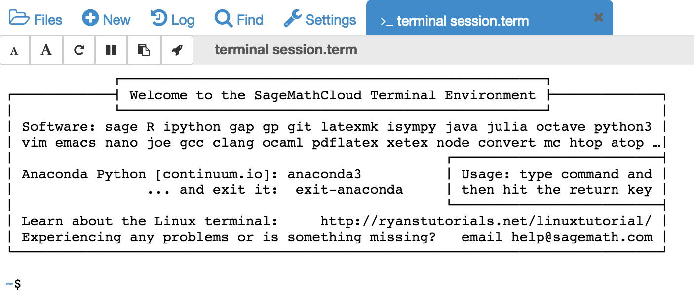

# A tour of SageMathCloud

SageMathCloud contains a lot of functionality including the ability to run Linux terminals, Jupyter Notebooks and Sage Worksheets along with a wide range of course management facilities. 

In this section, we'll take a closer look at some of the features not related to course management. Course management features are described elsewhere in this session.

### Create your first project

Log into SageMathCloud and click on the **projects** icon in the top left hand corner of the screen.

Click on **Create New Project**, fill out the **Title** and **Description** and click on **Create Project**

Once you've created it, click on the project title to open it. It will initially be empty so we'll start creating files

### Linux terminal

SageMathCloud provides full access to the Linux terminal. To open a terminal, click on **New** and give your session a name. I've used `terminal session` in the example. Click on **>_ Terminal** to begin your session

This starts up a traditional looking Bash session

The terminal welcome message gives you an idea of some of the software that's available. A partial list includes

* C, C++ and fortran compilers such as [gcc](https://gcc.gnu.org/) and [clang](http://clang.llvm.org/) and gfortran.
* Mathematical and statistical software such as sage, GNU Octave, R and Gap
* Text editors including vim, emacs, joe and nano
* Programming languages such as julia, ocaml
* The popular alternative to Bash, zsh
* Version control via git
* LateX

The distribution is based on Ubuntu Linux but it is not possible to install software yourself using `apt-get`.

TODO: Mention the .term file

TODO: Mention the lack of XWindows support

### Jupyter Notebooks

TODO - include range of terminals and interactivity.

### Sage Worksheets

TODO

### What can't be done in SageMathCloud?

TO DO: Microsoft Word/Powerpoint/Excel/local GUI x11/serious HPC/closed commercial software

 
