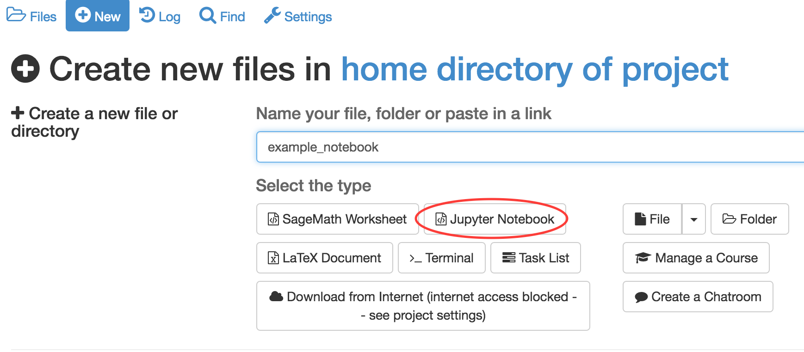
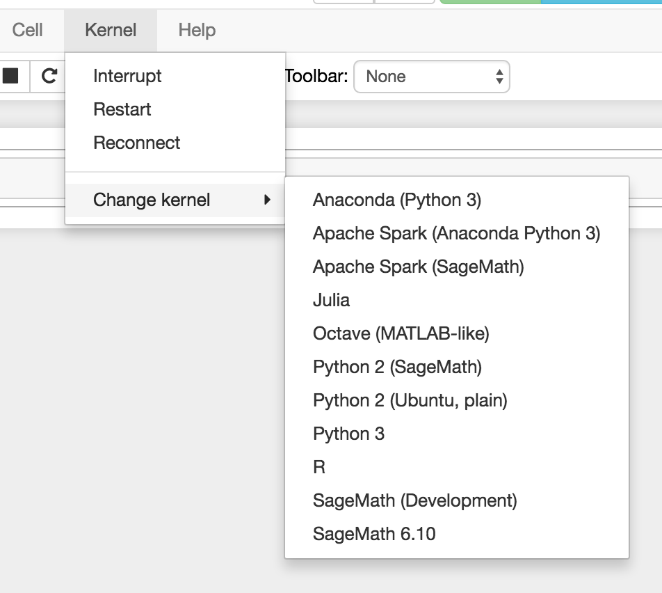
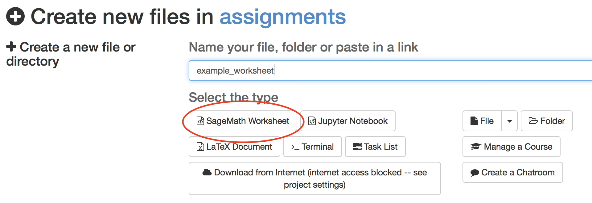

# A Tour of CoCalc
CoCalc contains a lot of functionalities, including the ability to run Linux terminals, Jupyter Notebooks and Sage Worksheets, along with a wide range of course management facilities.

In this section, we'll take a closer look at some of the features not related to course management. Course management features are described elsewhere in this session.

## Create your first project

Log into CoCalc and click on the **projects** icon in the top left hand corner of the screen.

Click on **Create New Project**, fill out the **Title** and **Description** and click on **Create Project**.

Once you've created your project, click on the project title to open it. It will initially be empty, so we'll start creating files.

## Linux terminal

CoCalc provides full access to the Linux terminal. To open a terminal, click on **New** and give your session a name. I've used `terminal session` in the example. Click on **>_ Terminal** to begin your session

This starts up a traditional looking Bash session

The terminal welcome message gives you an idea of some of the software that's available. A partial list includes:

* C, C++ and Fortran compilers such as [gcc](https://gcc.gnu.org/) and [clang](http://clang.llvm.org/) and gfortran
* Mathematical and statistical software such as Sage, GNU Octave, R and Gap
* Text editors, including vim, emacs, joe and nano
* Programming languages such as julia and ocaml
* The popular alternative zsh to Bash
* Version control via git
* LaTeX

The distribution is based on Ubuntu Linux but it is not possible to install software yourself using `apt-get`.

If you need something installed, contact the CoCalc team for [some help](#GettingHelp). Anything they install is then available to **all** CoCalc projects.

When you start a terminal session called `foo`, a file called `foo.term` is created. Its contents are not particularly interesting as they only mean something to the CoCalc system. The file is useful, however, in that it can be used to re-open a terminal session at the same place you previously left off (unless the session ends due to inactivity).  

## Jupyter Notebooks

To start a new Jupyter notebook, click on **New** and give your notebook a name. I've used `example_notebook` in the example. Click on **Jupyter Notebook** to open the notebook.

The notebook starts with a Python 2 kernel by default. Change the kernel by clicking on **kernel**->**change kernel** and selecting the kernel you want. There are several available including Python 3, R, Julia, Octave, SageMath and Apache Spark.

## SageMath Worksheets

To start a new SageMath Worksheet, click on **New** and give your worksheet a name (`example_worksheet` in our case ). Click on **Sage Worksheet** to open the worksheet.

## What can't be done in CoCalc?

CoCalc does not have integrated web-based support for X Windows, which means that applications that require a GUI cannot be used. This includes things like gedit, Spyder and xclock.  (You can use `ssh -X ...` from a computer with X windows support to display applications that run on SMC locally on your computer.)

Since CoCalc is Linux based, it is not possible to run Windows applications such as Microsoft Word, Powerpoint and Excel.

You might think it wouldn't be possible, but it **is** possible to install commercial software such as MATLAB or Mathematica on CoCalc if you have an appropriate license (some users do this).

## Getting help 

If you need help from the SageMath team, you can create a support ticket by emailing help@sagemath.com or clicking on the help icon in the top right hand corner of most CoCalc screens.

