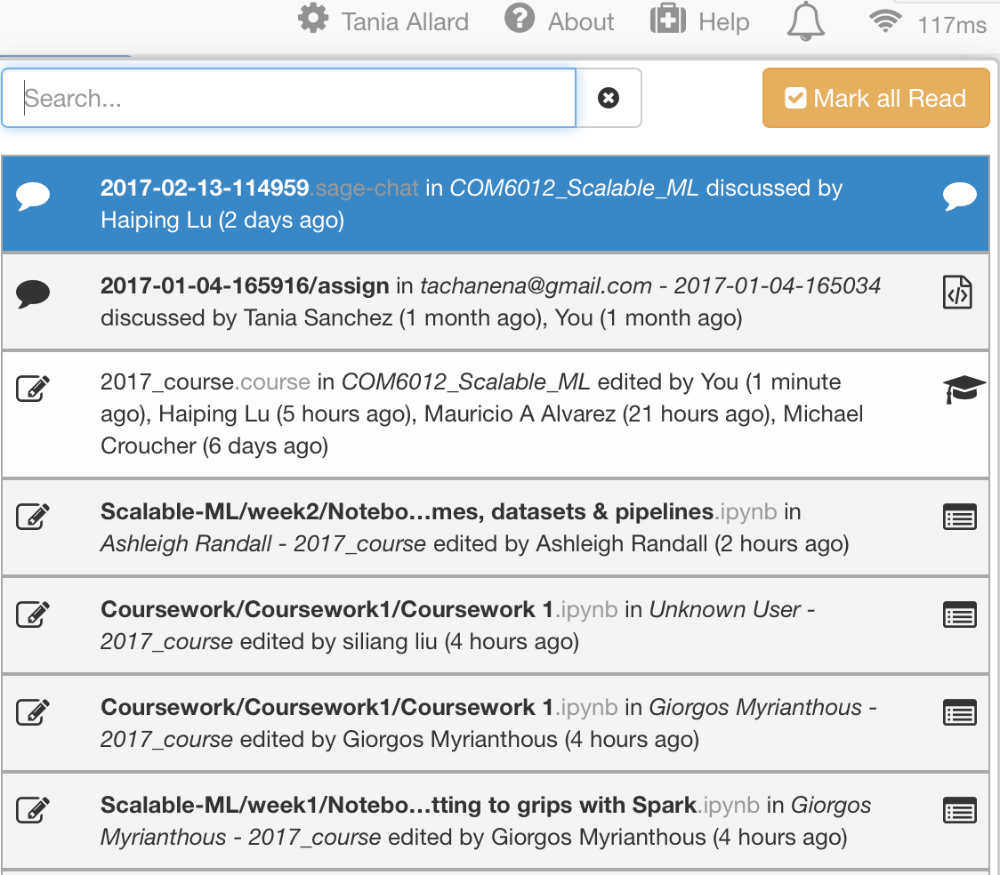

# Interacting with others
One of the best features from SMC is the ability to work collaboratively as well as being able to have real-time chat rooms with the students.

In this section you will make use of the cat functions to communicate with students.

First let's talk about the notifications. Every time a file is edited, added, or discussed you will get a notification in the upper right corner of the page i.e.:

If you click on the bell icon, you will see all the notifications along with an icon identifying the file/instance that was modified, and who changed it.

## Real time-chatrooms

You can create `.sage-chat` instances for the whole project.

You can use markdown, Latex, or HTML and the messages will render once you send them to the students.

 All the people in the course (students and lecturers) will receive instant notifications of the chat.

![notification](./assets/notification_highlighted.png

Chats can be used to share instant information such as links, or inform students when an important file has been added/modified.

---

## Exercise 5: create a chat room
Create a `.sage-chat` instance and try using markdown and Latex to send messages.

You can now use this as a discussion point with your peers!

## Extra: collaborative working
Choose a peer and together make simultaneous changes to the LaTex document you have created.

You will see the changes being made in real time!

---
