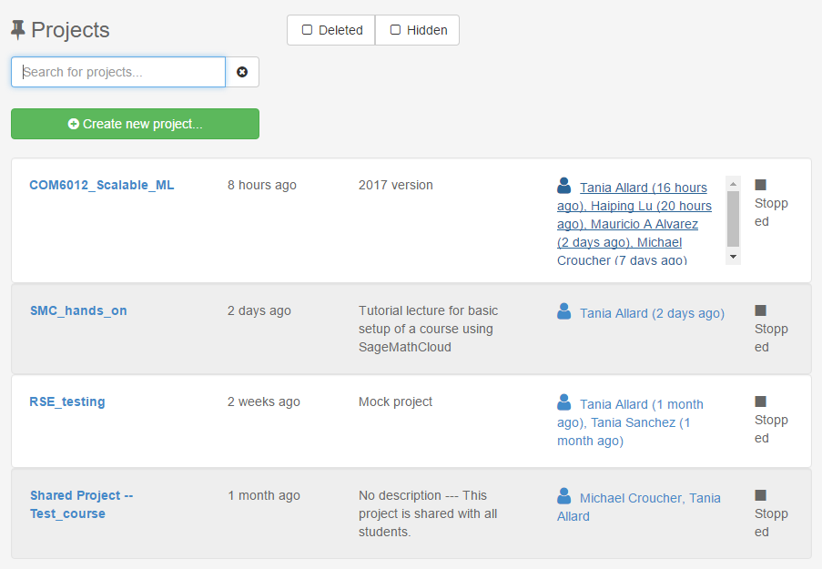
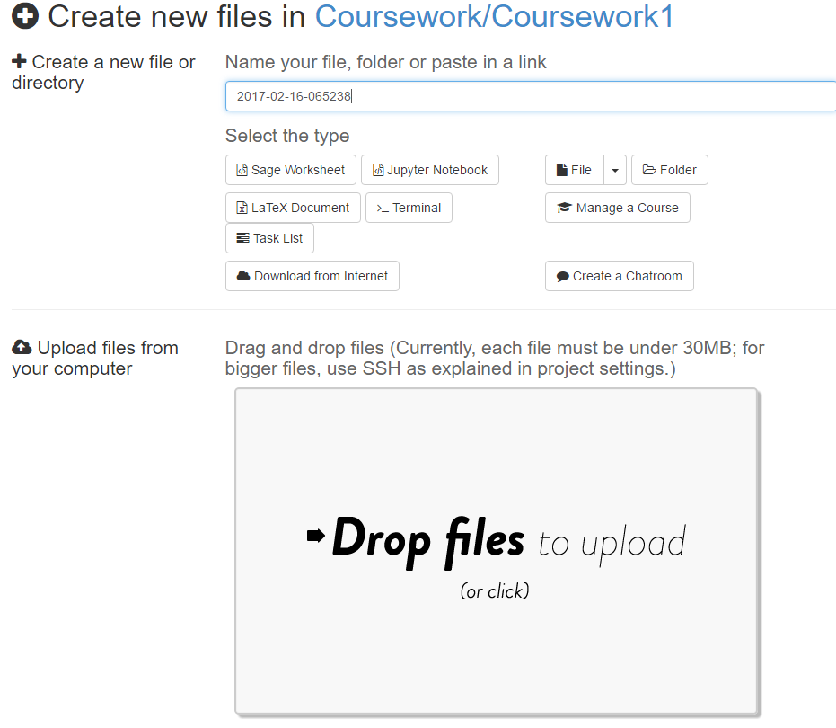
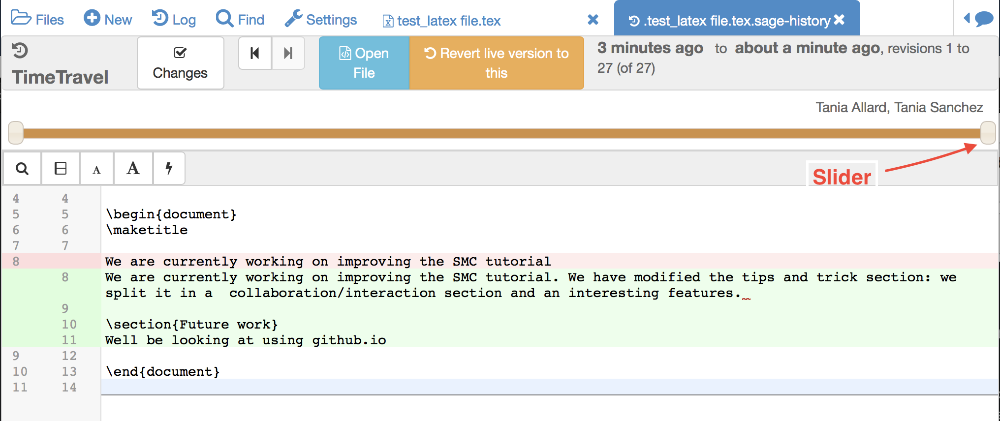
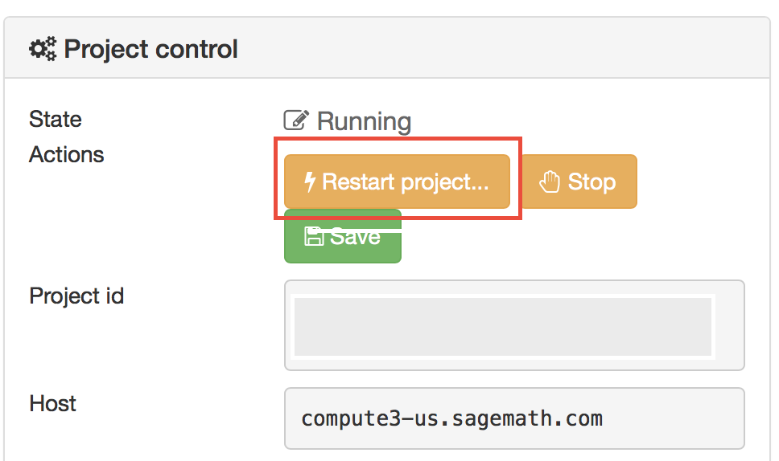

# I have a course on SMC... now what?

**_What is SageMathCloud?_**

 SMC is a cloud base service that provides support for courses based on interactive resources such as the [Jupyter Notebooks](http://jupyter.org).

**_Why SMC?_**

 As you are all aware technology is moving at an incredible speed, so it is only fair that education catches up! SMC is a platform that provides a high amount of versatility when it comes to course material handling and distribution.

 Also, being this a cloud service, you can access it from any computer you need to as long as you have internet access on it. Meaning that you do not need to install anything.

Plus it is a totally OpenSource project.

**_What happens when I finish the course/my degree?_**

Once you have finished your course you will still be able to access the material of past courses. However, your internet access into your account will only be valid for the duration of your course.

**_What I am getting?_**

The basic SMC accounts get a very limited memory size and no Internet access. It is more than likely that you have been upgraded for your course, if you need to see what resources you have, go to the **Settings** tab of your course.

---

## Access your course content
When you are first added to a course you will receive an email indicating the name of the course and inviting you to create a SMC account. Make sure to use the same email to that where you received the invitation. If you do not so you will not have access to the material and the upgrades available the course students.  
When you log into SMC you will se a panel as the one in the Figure below, click on the course you want to have access to.



Once you open the project you will be redirected to your course directory.

From there you can see all the files you lecturer has shared with you and the assignments.  


## Your assignments  

It is more than likely that you will be assigned assignments. When this happens you will have your own copy of the work you need to complete, so you can do all your changes/scripts in there.

Also, note the assignments will have been assigned a **due** date after which submission cannot be made.

It is also possible that as part of the assignment you need to add scripts, a report, or additional files. Make sure that they are all self contained in the directory of the assignment. When your coursework is collected the lecturers will get a copy of the assignment directory, so if you misplaced the documents they will not have access to them, and your marks will suffer.

There are multiple ways to do it:

* **Drag and drop**: If you have the files in your local computer navigate to your assignment folder. Once there click on the **New** button on the upper banner. Drag and drop the files in the corresponding box.



* **Content in the internet**: If you have your files in a gitHub repository, Dropbox, Google drive, or similar, click on the **New** button. On the file name box paste/write the url to the documents and click on the **Download from the internet** button.


* Terminal: if you have your files in a gitHub repository you can create a terminal instance and copy the contents using

```
git clone "url"
```

## Version control

One of the best features of SMC is the time travel diff feature. You will notice that your Jupyter notebooks (and many more files) have a **Time Diff** (file history) button.


If you click on this button you will see two sliders that you can move to see previous versions of the file:



This is extremely handy if you want to see a previously saved version of the document or revert to it.

Alternatively, you can also use git from the terminal if this is your preferred version control tool.


## Restarting a project
Every time you open a Jupyter notebook or a Sage Worksheet, its state is stored in memory. You might experience a slow navigation or sluggish kernel behaviour (e.g. cells not being evaluated).

To solve this you can stop your notebooks by clicking on the stop button.

Alternatively, you can restart the entire project, which will clean everything. You just need to go to your project settings and click on Restart project.



## Contacting your lecturer or TA
If you need assistance with a piece of coursework you can contact the using the real-chat features.  


Just click on the speech-bubble icon button located on the upper right hand corner of the piece of work you need help with and start typing straight away.

Your lecturer will be notified when this happens.
