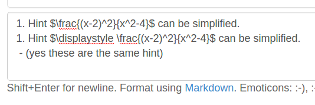
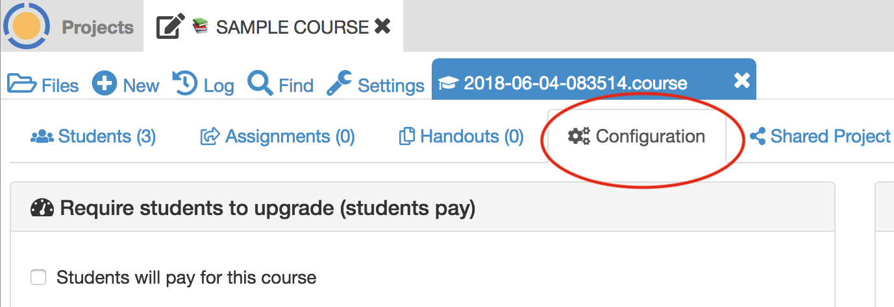

# Interesting features

### Using Git
Since it supports the terminal, students can also collaborate using git right in their own course-affiliated project.

## Text fields generally support markdown and LaTeX
The various text files in SMC support LaTex and markdown (specifically  [GitHub Flavored Markdown](https://github.com/adam-p/markdown-here/wiki/Markdown-Cheatsheet)).

For example, you can use LaTex syntax in the chat rooms:

which renders as

## Making multiple assignment folders quickly
So far we have shown how to create folders and files by using the new button every time. ->

However, such a method could prove to be quite time consuming when you need to create multiple folders. In this case you could create a shell script in your preferred programming language and run it from terminal.

Alternatively, in the files menu of your project, you can enter text like `assignments/assignment1/directions.md` then hit **enter** or **ctrl+enter** to create `directions.md` inside the folder `assignment1` within `assignments`. Hitting **enter** will open up the new file while **ctrl+enter** will silently create the necessary files and folders in the path.

You can also create folders here just by ending with a `/`

## Starting up everyone's project before class
By default, projects have a idle time of 24 hours before they spin down and need to be restarted. However, it may be handy to start everyone's project before a class or presentation so that they are all "hot loaded".

You can easily do this from your course manager:
first, make sure you are in your course settings and not your project settings.

Then scroll down to find and click on the `Start all...` button

## Restarting a project
Every time you open a Jupyter notebook or a Sage Worksheet, its state is stored in memory. This can become quite costly if you open multiple files one after the other.

To solve this you can stop every instance using the  stop button (for both Jupyter notebooks and Sage worksheets) once you have finished marking or working on it.

Alternatively, you can restart the entire project, which will clean everything. You just need to go to your project settings and click on **Restart project **.

