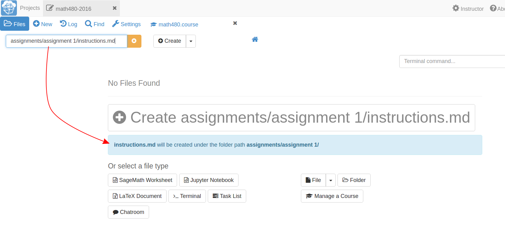

In this section we will present some CoCalc features and useful tricks that will make the management of your project easier.

## Text fields generally support markdown and LaTeX
CoCalc not only facilitates the creation of LaTeX documents, but most input areas in CoCalc support and render LaTeX and markdown  (specifically  [GitHub Flavored Markdown](https://github.com/adam-p/markdown-here/wiki/Markdown-Cheatsheet)).

For example, you can use LaTeX syntax in the chat rooms:

which renders as

## Making multiple assignment folders quickly
So far we have shown how to create folders and files by using the **New** button every time. ->

However, such a method could be quite time consuming when you need to create multiple folders, subfolders, and documents. If you are a terminal fan you could create a shell script in your preferred programming language and run it from the terminal.

Alternatively, in the files menu of your project, you can enter paths such as `assignments/assignment1/directions.md` then hit **enter** or **ctrl+enter** to create `directions.md` inside the folder `assignment1` within `assignments`. Hitting **enter** will open up the new file while **ctrl+enter** will silently create the necessary files and folders in the path.

You can also create folders here just by ending with a `/`

## Starting up everyone's project before class
By default, projects have an idle time of 24 hours before they spin down and need to be restarted. However, it may be handy to start everyone's project before a class or presentation so that they are all "hot loaded".

You can easily do this from your course manager:
first, open the course configuration tab:

Then scroll down to find and click on the `Start all...` button

## Restarting a project
Every time you open a Jupyter notebook or a Sage Worksheet, its state is stored in memory. This can become quite costly if you open multiple files one after the other (e.g. when you are marking your students' work).

To solve this, you can stop every instance using the stop button (for both Jupyter notebooks and Sage worksheets) once you are done with your marking.

Alternatively, you can restart the entire project, which will clean everything. You just need to go to your project settings and click on **Restart project**.

## Using Git
CoCalc support for the terminal enables students (and instructors) to collaborate using Git within a course-affiliated project.

If you already have a project or some files allocated in GitHub you can add them to your project.
Click on the **New** button and add/paste the link to your repository in the appropriate text box. Click on the **Download from Internet** button.

(*Obvious note*: You need to have internet access enabled in your project.)

Also you can use the terminal to commit and push changes to your repository in GitHub.

## Time Travel Diffs
The editor based documents (e.g. Python code, LaTeX documents, markdown files, etc.) as well as Jupyter notebooks and Sage worksheets are Time Travel Diffs supported. The Time Travel Diffs feature allows you to see what happened with a file within a certain time interval.

Open up **Time travel** from any document:

then click on changes and drag the sliders to see the document in a given time interval.

If you need to revert the document to a previous state, drag the slider to the desired revision and click on **Revert live version to this**. Doing so reverts the document contents to that specific version. If you have checked the **Changes** box to compare two revisions and click on **Revert live version to this**, contents are reverted to the latter of the two revisions being compared. Note that reverting a file simply creates a new version of the file equal to the old file at that point in time; in particular, no work is lost!
